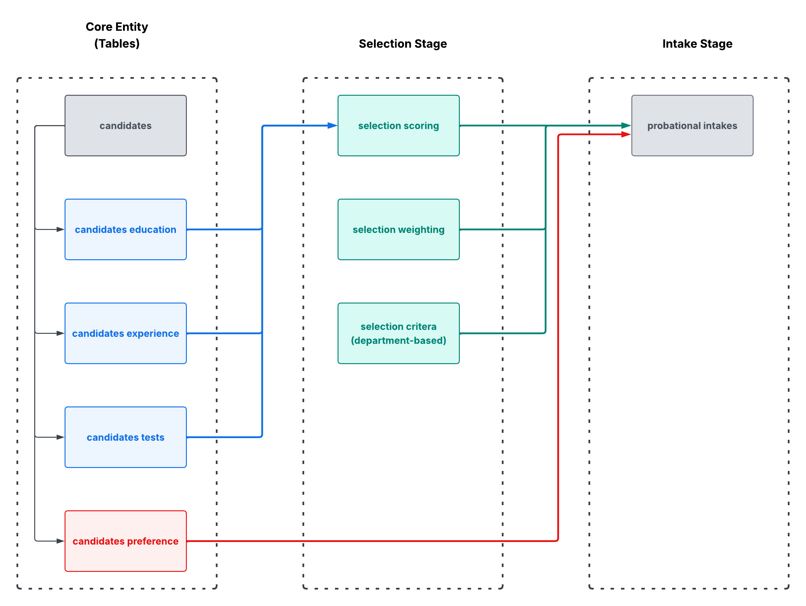
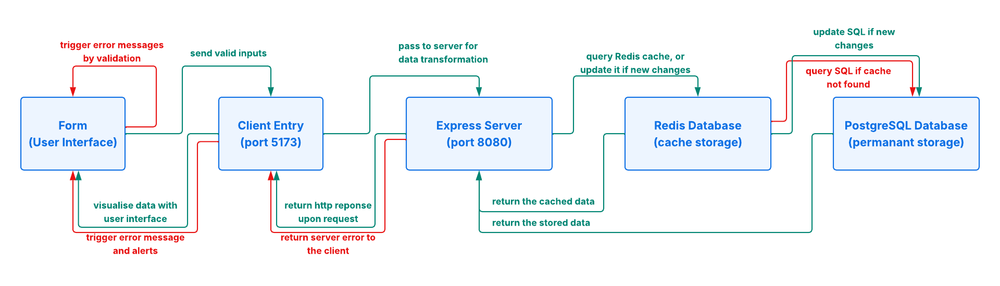

# Atrium - Workforce Routing System

**Live Demo:** [https://client-seven-pi-16.vercel.app](https://client-seven-pi-16.vercel.app)

<br/>

## Contents

- [Overview](#overview)
- [Features](#features)
- [Installation / Initialisation](#installation--initialisation)
- [Architecture](#architecture)
- [Dependencies](#dependencies)

<br/>

## Overview

### A. Introduction

Companies often lack consistent procedures on assigning the new hires, leading to high dropout rates, poor role fits and the waste of resources.

The Atrium Platform is a full-stack web application that systematically matches candidates with departments throughout candidate selection. It shows assignment outcomes during the selection stage, which is designed to support strategy review in the future.

<br/>

### B. Origin and Redesign

This project was initially based on [Jonas Schmedtmann's Node.js Bootcamp](https://github.com/jonasschmedtmann/complete-node-bootcamp) — an online trip booking platform built with Pug, Express, and MongoDB (server-side rendering).

It was subsequently transformed and re-designed into a talent selection platform, with the following changes made upon the original structure:

- **Architecture**: Improved from MVC to Domain-Driven Design with a 4-layer backend division of business logic from data access.
- **Tech stack**: Replaced JavaScript with TypeScript, MongoDB with PostgreSQL, and Pug with React (client-side rendering).
- **New additions**: Introduced Redis caching, React Form, Tailwind CSS, Redux and logging.

<br/>

## Features

### A. Weighted Score and Evaluation Mechanism

Calculating candidate scores with configurable factors (e.g. background, interview performance, and training results). Adjustable weightings support flexible and consistent evaluation with comparisons.

### B. Preference-oriented and Multi-Round Matching

Matching candidates and departments according to their preferences and department priorities. Unmatched candidates will be reassigned based on remaining quota after serveral rounds of screening.

### C. Comparable Evaluation of Selection Strategies (to be developed)

Systematically re-running the selection process with different configurations, comparing various outcomes (e.g. passing rate, dropout rate, preference satisfaction) for management decision. 

<br/>

## Installation / Initialisation

For project setup, you need to install Node.js v18+, PostgreSQL, and Redis to proceed further.

Please clone the project at the <a href='https://github.com/chkfu/atrium-workforce-routing-system.git'>Github repository</a>.


### A. Server side setup (development environment)

Beginning with a new terminal, and run the CLI with the commands below:

```
$ cd server
$ npm install
$ npm run dev
```

The server will be available at `https://localhost:8080` (or specified).

### B. Client side setup (development environment)

For browser display, please start the second terminal and run the below commands:

```
$ cd client
$ npm install
$ npm run dev
```

The client will be available at `http://localhost:5173` (or specified).

### C. Production environment

The server is hosted on `fly.io` at `https://atrium-server-express-20260812.fly.dev`, and the client is hosted on `vercel` at `https://client-seven-pi-16.vercel.app`.

See [Deployment Guide](docs/developer-guide.md#deployment-guide) in the developer guide for setup and redeployment instructions.

<br/>

## Architecture

Atrium adopts domain-driven architecture with a layered backend to separate request handling, business logic and data access. Business features are organised into independent domain modules for enhancing maintainability and scalability.

<p>
  
</p>

### A. Request-Response Flow

This project illustrates the request-response lifecycle and highlights the interaction between layers and the integration of Redis caching with the PostgreSQL database:

<p>
  
</p>

### B. Key Components

- Domain-driven modular organisation
- Layered API architecture (Routes → Controllers → Services → Repositories)
- React + Redux for frontend state management
- PostgreSQL and Redis for persistence and caching

The server-side is organised into multiple domain modules to keep logic independent, complying with the design principles of "low coupling, high cohesion" (see architecture.md for more design trade-offs and considerations).

<br/>

## Dependencies

| Scope  | Category          | Package            | Version |
| ------ | ----------------- | ------------------ | ------- |
| Client | Framework         | react              | ^18.3.1 |
| Client | Styling           | tailwindcss        | ^4.2.4  |
| Client | State Management  | redux              | ^4.2.0  |
| Server | Framework         | express            | ^5.2.1  |
| Server | Security          | express-rate-limit | ^8.3.1  |
| Server | Database          | pg                 | ^8.20.0 |
| Server | Cache             | redis              | ^5.12.1 |
| Server | Logging           | winston            | ^3.19.0 |

See `client/package.json` and `server/package.json` for the full package list.

<br/>

<i> Author: kchan </i>
</br>
<i> Last Updated: Aug 12, 2026 </i>
