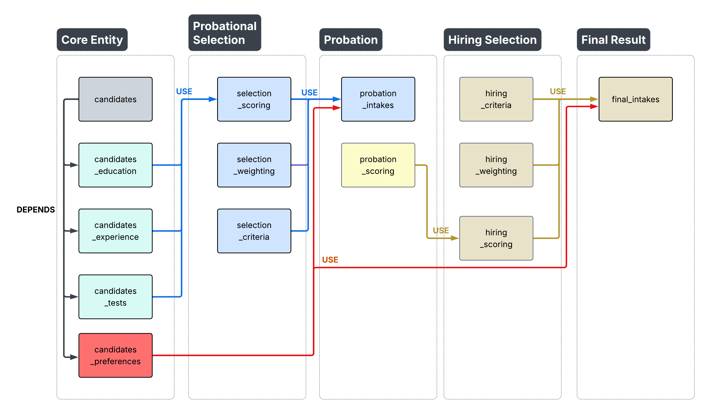
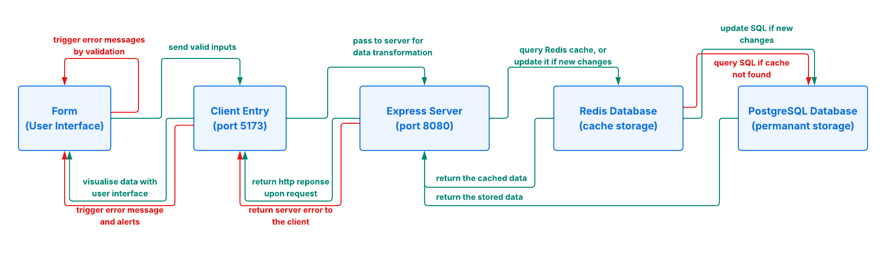
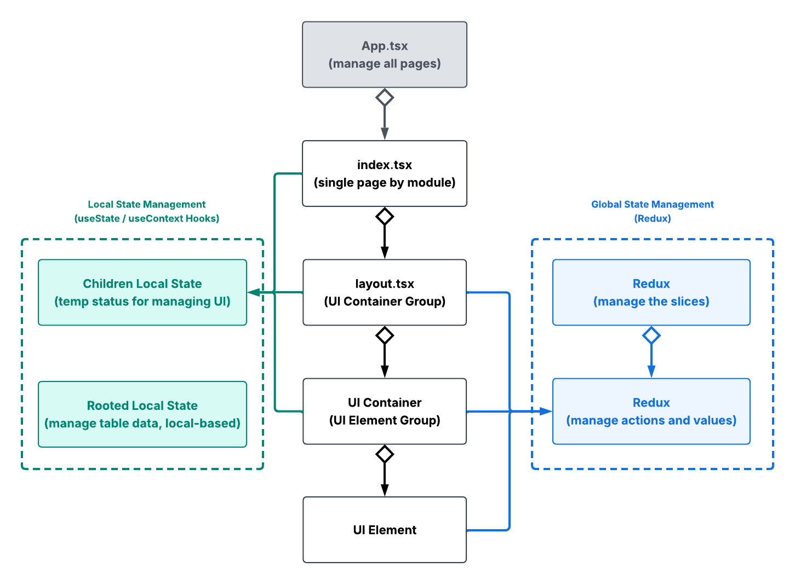
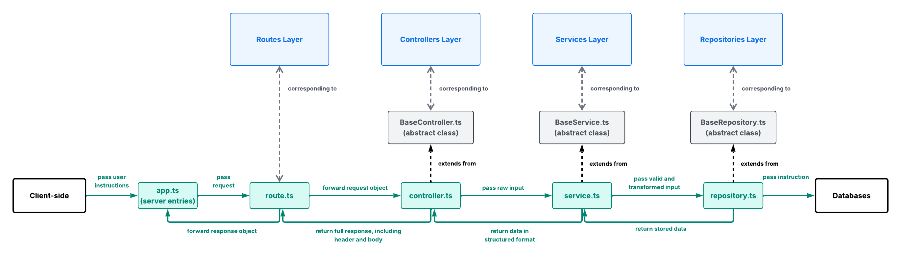
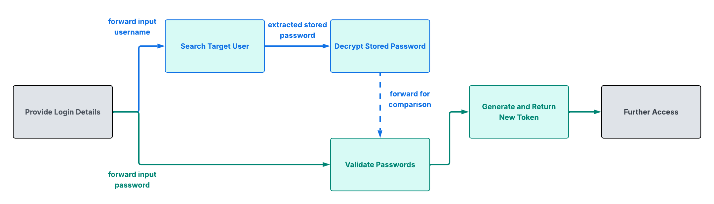
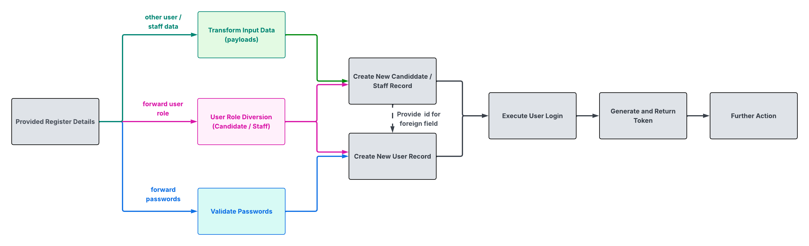
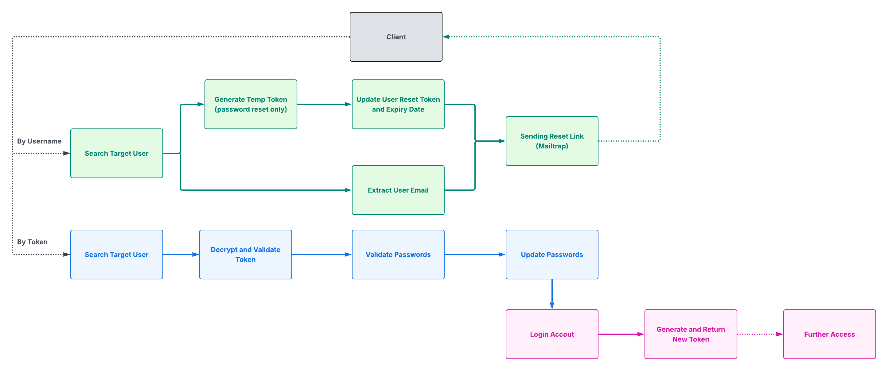
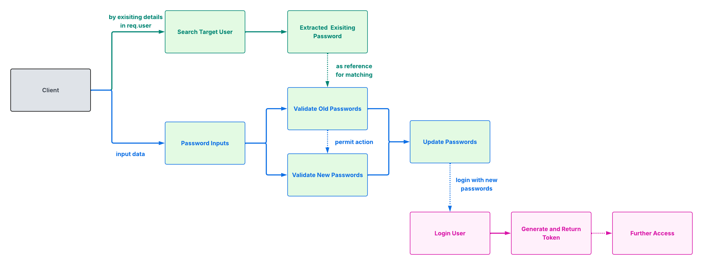

<!--

Learnt:

The architecture.md file use to explain the principle of the system design,
answering the questions why certain layer and modules has been built.

The documents will insert the Lucid charts with few lines of descrition,
helping future developer to understanding the system rationale and maintain
efficient codes practice, and follow the established architectural practices.

-->

## ARCHITECTURE

This file records the plans and considerations of thre architecture design.

<br/>

## Contents

- [General Design](#general-design)
- [Project Structure](#project-structure)
- [Workflow](#workflow)
- [Technical Consideration and Limitations](#technical-consideration-and-limitations)

<br/>

## General Design

### A. Overall Design

The Atrium Platform follows Domain-Driven Design, with a modular API pipeline of routes, controllers, services and repositories. Each layer focuses on their module specialties for clarifying boundaries between request handling, business logic and data access.

### B. Module-Based Organisation

RESTful API modules has been grouped into seven key categories:

| Module Group     | Description                                       |
| ---------------- | ------------------------------------------------- |
| group_system     | System operational settings related.              |
| group_candidate  | New hires related, and their related information. |
| group_department | Departmental structure and agenda.                |
| group_selection  | Considerations related to pre-training intakes    |
| group_probation  | Considerations related to probational performance |
| group_hiring     | Considerations related to official hiring         |
| group_final      | Final Result of Intakes                           |

These core modules will support the two-tiered workflows for candidate selection as shown in below:

#### (1) Candidate Selection Flow

The multi-stage flow helps to track the candidates’ journey from application to final enrollment. It specifically centralises the raw data, serving for further performance and metrics evaluation in the major intaking periods - <i>probational selection (phase 1) and hiring selection (phase 2)</i>.

<p>
  
</p>

### C. Layered Architecture

Each module contains API layers to ensure clear division of responsibilities between application flow and domain logic:

| Layer              | Responsibility                                                            |
| ------------------ | ------------------------------------------------------------------------- |
| Routes Layer       | Defines the API entry points and forward https requests to controllers.   |
| Controllers Layer  | Validates client inputs and https requests, forwarding tasks to services. |
| Services Layer     | Handles core business logics, receiving data for further transformation.  |
| Repositories Layer | Manages queries for direct database access.                               |

Each layer adheres with the single directional relationship, while processing the data with the top-down dependencies. This model ensures layers to specialise to their logics and responsibilities, preventing over-coupling among the modules.

<br/>

## Project Structure

```
.
├── client/                         # Frontend application
│   ├── src/
│   │   ├── auth/                   # Authentication
│   │   ├── components/             # Shared layout components (Header, Footer, etc.)
│   │   ├── config/                 # Application configuration
│   │   ├── elements/               # Reusable UI components
│   │   ├── pages/                  # Application pages
│   │   ├── redux/                  # Global state management
│   │   ├── utils/                  # Shared types, helpers, and utilities
│   │   └── assets/                 # Static assets
│   └── ...
│
├── server/                         # Backend application
│   ├── src/
│   │   ├── auth/                   # Authentication
│   │   ├── core/                   # Base API classes and templates
│   │   ├── infra/                  # Infrastructure (database, logging, middleware, caching, SSL, etc.)
│   │   ├── modules/                # Domain-driven feature modules
│   │   │   └── <module-name>/
│   │   │       ├── *.routes.ts
│   │   │       ├── *.controller.ts
│   │   │       ├── *.service.ts
│   │   │       └── *.repository.ts
│   │   └── util/                   # Shared types, validation, configuration, errors
│   └── ...
│
└── docs/                           # Project documentation
```

<br/>

## Workflow

### (A) Request-Response Flow

<p>
  
</p>

### (B) State Management Flow

<p>
  
</p>

### (C) Data Processing Flow

<p>
  
</p>

### (D) Authentication

#### 1. Login Flow

<p>
  
</p>

#### 2. Registration Flow

<p>
  
</p>

#### 3. Reset Password Flow (external access)

<p>
  
</p>

#### 4. Reset Password Flow (self-access)

<p>
  
</p>


<br/>

## Technical Consideration and Limitations

### A. Design Trade-off

#### (1) Managing Complex Modular Structure

- Solution: Converted to layered structure with model, controller, service and repository modules, decoupling functionalities and logics for better maintenance.
- Tradeoff: New features requires to updates in more layers with additional efforts on managing module coordination and ensuring their completeness.

#### (2) Prevent Database Overloading

- Solution: Implemented Redis caching, rate limiting and lock, as the database-level shelter reducing loads and against race competition.
- Tradeoff: Requires additional redis handlers for the querying methods with more complex modular relations, plus extra costs for setup and maintain the redis server.

### B. Limitations

#### (1) Long-term Data Dependency

- The design has limitation handling frequent strategy changes, as each recruitment batch presented as variable factors. Lack of data consistency could harm the reliability and failed to match the fair test requirements.

#### (2) Limited refactorisation for Page Interface

- The client-side only adopted minor reusable components, but still yet to established modular structure causing by the complexity from table's specific columns and state management. Future improvements required.

<br/>

<i> Author: kchan </i>
</br>
<i> Last Updated: June 27, 2026</i>
