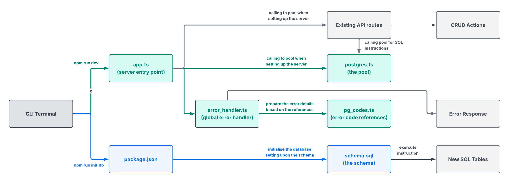
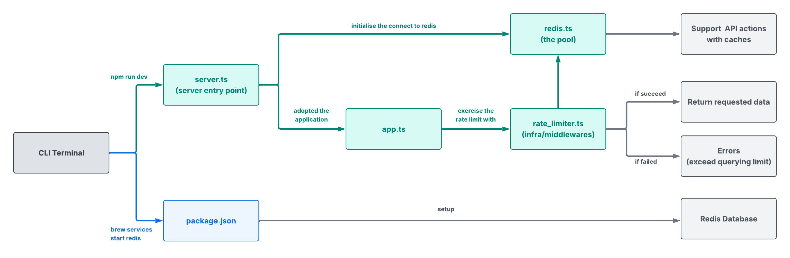

<!--

Learnt:

The developer-guide.md file use to educate the future developers internally on
how to edit, expand and append the new elements.

It ensures future developers could make changes on the system within the
specific structure.

-->

# DEVELOPMENT GUIDE

This guide provide the instructions for setting up the dev environment, maintaining the project and understanding the system operation.

<br/>

## Contents

- [Installation Guide](#installation-guide)
- [Database Setups Guide](#database-setups-guide)

<br/>

## Installation Guide

For project setup, you need to install Node.js v18+, PostgreSQL, and Redis to proceed further.

Please clone the project at the <a href='https://github.com/chkfu/atrium-workforce-routing-system.git'>Github repository</a>.

### A. Server side setup (development environment)

Beginning with a new terminal, and run the CLI with the commands below:

```
$ cd server
$ npm install
$ npm run dev
```

The server will be available at `https://localhost:8080` (or specified).

### B. Client side setup (development environment)

For browser display, please start the second terminal and run the below commands:

```
$ cd client
$ npm install
$ npm run dev
```

The client will be available at `http://localhost:5173` (or specified).

<br/>

## Database Setups Guide

### A. Initialise Neon PostGre database

#### (1) database setup

You may check the current postgresql version with:

```
$ psql --version
```

Please run the below CLI instructions at terminal if it has not been installed:

```
$ brew install postgresql@17
$ brew services start postgresql@17

```

Once installed, the initialization script in `package.json` will execute the schema file by running:

```
$ npm run db:init
```

This creates all required tables and enums defined in the schema.

#### (2) operational rationale

In `src/infra/database`, PostgreSQL codes have been stored in the listed files in below:

| File Name  | Usage         | 
| ------ | ----------------- | 
| postgres.ts | Initialises database connection pool and manages connections |
| pg_codes.ts | Reference list for PostgreSQL error codes to HTTP status codes| 
| schema.sql | Defines schema for forming tabular data and their inter-relations therein. | 

<p>
  
</p>

<br/>

### B. Initialise Redis

#### (1) database setup

You may check the current Redis version with:

```
$ redis-cli --version
```

Please run the below CLI instructions at terminal if it has not been installed:

```
$ brew install redis
$ brew services start redis
```

Once installed, verify Redis is running:

```
$ redis-cli ping
```

Rate limiting is performed through the `rate-limit-redis` middleware. No additional initialization scripts are required.

#### (2) operational rationale

In `src/infra/database`, Redis codes have been stored in the listed files in `redis.ts`.

<p>
  
</p>

<br/>

# SSL/TLS Setup Guide

To support HTTPS connection, SSL/TLS certificate is requried to encrypt the sensitive data when it is transistioning. 

<br/>

### Step 1:

Create RSA-encrypted keys:

```
$ openssl genrsa -out privatekey.pem 2048
```

2048 provides higher standard of key encryption but slightly longer time cost

<br/>

### Step 2:

Setup certificate requirement:

```
$ openssl req -new -key privatekey.pem -out csrreq.csr
```

<br/>

### Step 3:

Based on PKI protocol for CA certificate:

```
$ openssl x509 -req -days 365 -in csrreq.csr -signkey privatekey.pem -out ca.pem
```

Short expiry is a kind of security practice for protection, but the 365 days has been set for local development.

<br/>

### Step 4:

To secure the designated connection, you may install mkcert and then generate key and cert using:

```
$ mkcert -install
$ mkcert {designated_address}
```

With the example of `localhost`, please run:

```
$ mkcert localhost
```


<br/>

<i> Author: kchan </i>
</br>
<i> Last Updated: June 28, 2026</i>
